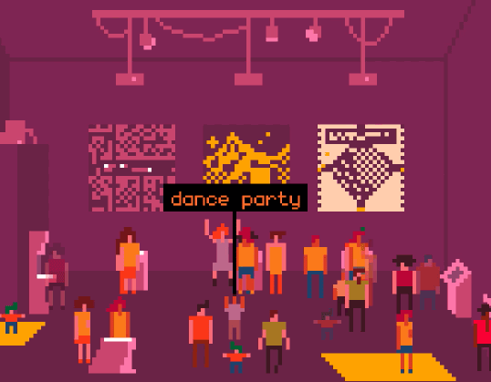

# BitHotel

Choose an avatar and hang out with your friends in a virtual version of a 16bit pixel based hotel, situated in the vintage times of 80's

BitHotel is built with node.js, socket.io, [p5.js](https://p5js.org/), and the add-on [p5.play](https://molleindustria.github.io/p5.play/), it's hosted on [heroku.com](https://heroku.com/).  

BitHotel is based on LIKELIKE, a project by [Molleindustria](http://molleindustria.org/).  

Licensed under a GNU Lesser General Public License v2.1.

