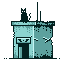

# Welcome to the BitHotel 

Choose an avatar and hang out with your friends in a virtual hotel!
A pixel based 2d multiplayer social environment for people all over the world to meet and interact with each other. 
Here, you can chat with others, explore different rooms, hangout with pet harvey in the backyard, sing with the alphabets in the rhyme room, or enjoy the comfort in VIP room.
		
BitHotel is built with node.js, socket.io, [p5.js](https://p5js.org/), and the add-on [p5.play](https://molleindustria.github.io/p5.play/), it's hosted on [heroku.com](https://heroku.com/)  

## Contributing
You may contribute to the code by sending pull requests. If you are a pixel art designer, you may update the designs as well as the hotel appearance. Trust me, it means alot for the BitHotel family.

BitHotel is based on LIKELIKE, an awesome project by [Molleindustria](http://molleindustria.org/). 

Licensed under a GNU Lesser General Public License v2.1.

